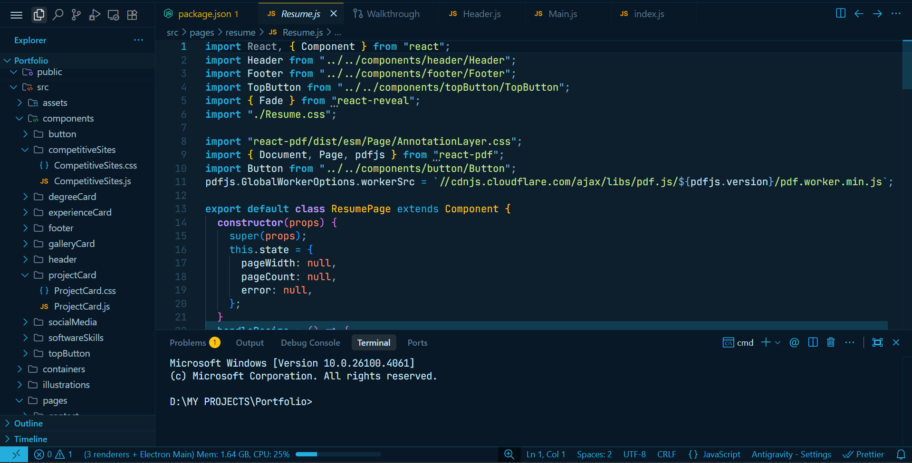
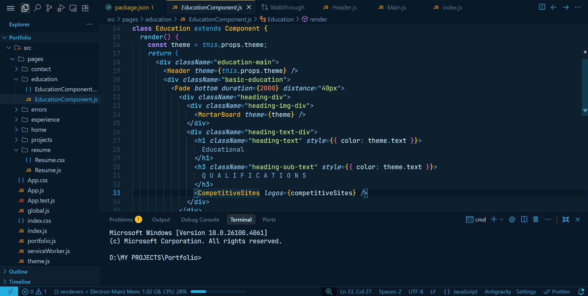

<div align="center">

# 🩵 SJ-Theme-VsCode

### A beautiful azure-theme VsCode extension, easy for eyes and psychologically relaxing.


<br/>

[](https://marketplace.visualstudio.com/items?itemName=saksham-joshi.sj-theme)
[](https://marketplace.visualstudio.com/items?itemName=saksham-joshi.sj-theme)
[](https://github.com/saksham-joshi/SJ-Theme-VsCode)


</div>

---

## 📸 Preview

<div align="center">






</div>

---

## ✨ Features

- 🎨 **Vibrant Colors** - Carefully selected color palette for optimal readability
- 👁️ **Eye Comfort** - Designed to reduce eye strain during long coding sessions
- 🌈 **Syntax Highlighting** - Enhanced syntax highlighting for better code comprehension
- ⚡ **Modern Design** - Clean and contemporary aesthetic
- 🎯 **Theme Color** - Primary accent: `#24aedd`

---

## 🚀 Installation

### Via VS Code Marketplace

1. Open **Visual Studio Code**
2. Go to **Extensions** (Ctrl+Shift+X / Cmd+Shift+X)
3. Search for **"SJ Theme"**
4. Click **Install**
5. Select the theme from **Preferences > Color Theme**

### Via Command Line
```bash
code --install-extension saksham-joshi.sj-theme
```

---

## 🎨 Theme Specifications

| Property | Value |
|----------|-------|
| **Primary Color** | `#24aedd` |
| **Type** | Dark Theme |
| **Optimized For** | JavaScript, TypeScript, Python, C++, Java |

---

## 👨‍💻 Developer

<div align="center">

<table>
<tr>
<td align="center">


### Saksham Joshi

[](https://github.com/saksham-joshi)
[](https://www.linkedin.com/in/sakshamjoshi27)
[](https://sakshamjoshi.vercel.app)
[](mailto:social.sakshamjoshi@gmail.com)

</td>
</tr>
</table>

</div>

---

<div align="center">

**Made with 🩵 by [Saksham Joshi](https://github.com/saksham-joshi)**

*Designed for developers who love beautiful code* ✨

</div>